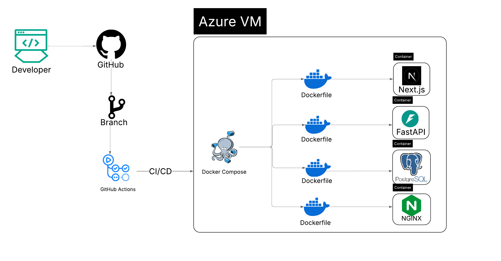
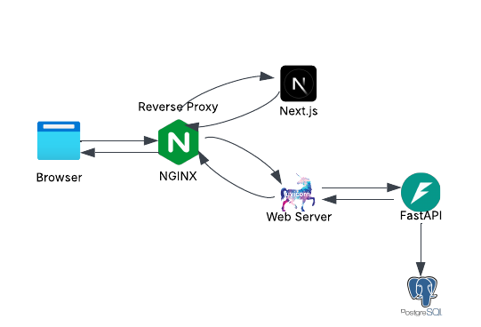
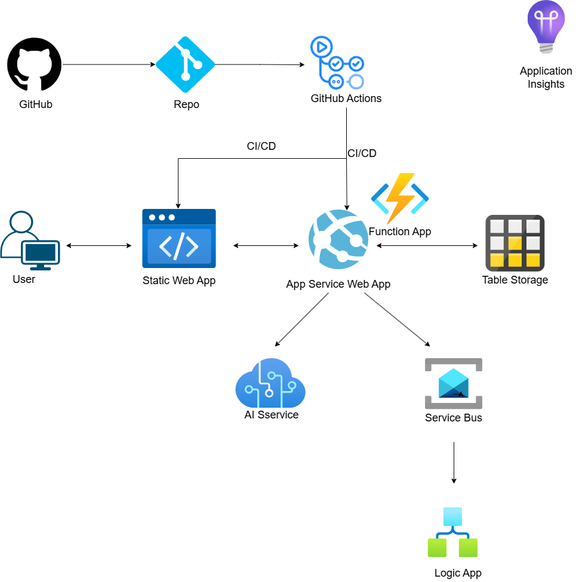

# To-Do List

## Project Overview
A simple to-do list app serving as a training project for implementing containerization and cloud deployment strategies.

## Features
- Basic operations for tasks
- Simple UI for demonstration purposes
- RESTful API endpoints
- Containerized setup for practicing Docker concepts
- Cloud services implementation for practicing Azure services

## Technology Stack

### Frontend
- Framework: Next.js
- Styling: Tailwind CSS
- API Communication: Axios

### Backend
- Option 1
  - Framework: FastAPI (Python)
  - Data validation: Pydantic
  - API Design: RESTful API
- Option 2 (`backend_azure_func_app_with_azure_table` branch)
  - Azure Function Apps

### Database
Options
- PostgreSQL for data persistence. Managed through Docker container
- Azure Table Storage as cloud solution
  
### Others
- Nginx for reverse Proxy for dockerization solution

## Deployment

### Master Branch
Master branch focuses on Docker containerization and local development.

1. Clone the repository
2. Set up environment variables in `.env` file
3. copy `nginx.conf` as `nginx.dev.conf`
4. Run `docker compose up --build`
5. Access frontend at `http://localhost:3000`
6. Access backend API at `http://localhost:8000`

- Could be deployed to an Azure VM via `local_deploy_to_vm.sh` or GitHub Actions `cd-container-apps-azure-vm.yml`
- `cd-frontend-azure-static-web-apps.yml` takes actions to deploy the frontend to Azure Static Web App service. the backend base API `NEXT_PUBLIC_API_URL` is store as GitHub secrets

#### Azure VM Deployment Workflow

  

#### Containerized Application Architecture

  

### Azure Deployment Branches
Azure-specific branches explore different Azure deployment strategies.

- `backend_azure_web_app_with_azure_table`: Backend Deployment to Azure App Service Web Apps.
- `backend_azure_func_app_with_azure_table`: Backend is built with Azure Function Apps.
- The branches also contain the implementations of Azure Service Bus (sending scheduled messages) and AI chatbox built with Azure AI Service.

#### Cloud Solution Architecture

  

